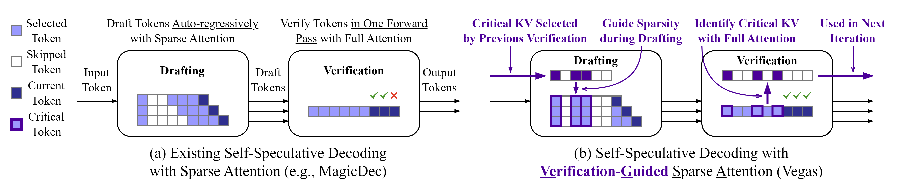

<!-- markdownlint-disable MD001 MD041 -->

# Vegas: Verification-Guided Sparse Attention for Self-Speculative Decoding

[](https://arxiv.org/abs/2602.07223)
[](assets/poster.png)

<p align="center">
  
</p>

## Abstract

Long-context large language model (LLM) inference has become the norm for today's AI applications. However, it is severely bottlenecked by the increasing memory demands of its KV cache. Previous works have shown that self-speculative decoding with sparse attention, where tokens are drafted using a subset of the KV cache and verified in parallel against the full KV cache, speeds up inference in a lossless manner. However, they rely on a standalone KV selection algorithm to select the KV entries used for drafting and overlook the fact that the criticality of each KV entry is inherently computed during verification.

To this end, we propose Vegas, a self-speculative decoding method with verification-guided sparse attention. Vegas identifies critical KV cache entries as a byproduct of verification and computes attention only over these entries when drafting subsequent tokens. This not only improves the draft token acceptance rate but also incurs low KV selection overhead, thereby improving decoding throughput. Vegas achieves a 1.25×-2.81× speedup in decoding throughput over default vLLM and a 1.15×-1.29× speedup over state-of-the-art sparse attention-based self-speculative decoding methods.

## Features

- **Verification-guided KV selection.** During each verification pass Vegas
  collects per-token attention importance (raw pre-softmax logits, or
  rematerialized softmax weights) and ranks the KV cache. On the next draft
  step, instead of attending to the full cache, the model attends to only the
  top-k highest-ranked entries plus the most recent tokens. In other words, the
  draft attends to the entries verification deemed important.
- **Self-speculation, no extra model.** The same weights draft and verify, so
  there is nothing extra to download, train, or keep in memory.
- **Sparse-attention drafting.** The draft pass runs flash-attention over only
  the selected slots via a custom per-step page table, cutting draft attention
  cost on long contexts.
- **CUDA-graph compatible.** Both the verify and draft passes run under CUDA
  graphs; the sparse page table and per-request KV budgets are rebuilt each
  propose so replayed graphs stay correct.

## Installation

Vegas is implemented as a fork of vLLM and builds against a companion
[flash-attention fork](https://github.com/npz7yyk/vllm-flash-attn) (CUDA 12.x,
FlashAttention-3). Build from source:

```bash
git clone https://github.com/platformxlab/vegas.git
cd vegas
pip install -v -e .   # compiles the CUDA/FA3 kernels; takes a while
pip install datasets  # for benchmarks
```

## Usage

Enable Vegas by passing a `speculative_config` with `method="sparse_attn"`:

```python
from vllm import LLM, SamplingParams

speculative_config = {
    "method": "sparse_attn",
    "num_speculative_tokens": 6,
    "sparse_attn_algorithm": "vegas",   # Also supported: "streamingllm"
    "sparse_attn_ratio": 0.07,          # fraction of KV kept for drafting
    # "sparse_attn_min_tokens": 256,    # floor on the per-request KV budget
}

llm = LLM(
    model="Qwen/Qwen3-8B",
    speculative_config=speculative_config,
)
print(llm.generate(..., SamplingParams(...)))
```

Key knobs (`speculative_config`):

| Field | Meaning | Default |
| --- | --- | --- |
| `sparse_attn_algorithm` | `"vegas"` or `"streamingllm"` | `"streamingllm"` |
| `sparse_attn_ratio` | Fraction of KV kept for drafting | `0.05` |
| `sparse_attn_min_tokens` | Floor on the per-request KV budget | `256` |
| `num_speculative_tokens` | Draft length per step | / |

The top-k ranking metric (`"logit"` raw scores vs `"weight"` rematerialized
softmax weights) is a class-level `SCORE_MODE` toggle on `VegasAttnOverrider`.

## Example

A complete, runnable end-to-end example (AIME'25, Qwen3-8B) lives in
[`benchmarks/benchmark_vegas.py`](benchmarks/benchmark_vegas.py):

```bash
python benchmarks/benchmark_vegas.py
```

## Code Layout

Vegas lives in a self-contained module under `vllm/v1/spec_decode/sparse_attn/`,
plus a handful of edits to wire it into vLLM's speculative-decoding path.

```text
vllm/v1/spec_decode/sparse_attn/
├── proposer.py                     # SparseAttnProposer: drives the self-speculative draft loop
├── attn_overrider/
│   ├── __init__.py                 # BaseAttnOverrider + build_attention_overrider() dispatch
│   ├── vegas.py                    # VegasAttnOverrider: verification-guided KV selection
│   ├── streamingllm.py             # StreamingLLMAttnOverrider: sink + sliding-window baseline
│   └── utils/
│       ├── varlen_reduce.py        # CUDA kernel: reduce per-query scores/weights -> per-token metric
│       └── varlen_topk.py          # CUDA kernel: variable-length top-k KV selection
```

Integration points (edited vLLM files):

| File | What it does for Vegas |
| --- | --- |
| `vllm/config/speculative.py` | Adds the `sparse_attn_*` config fields (`method="sparse_attn"`) |
| `vllm/v1/worker/gpu_model_runner.py` | Constructs and drives `SparseAttnProposer`; CUDA-graph wiring |
| `vllm/v1/spec_decode/utils.py` | Shared spec-decode helpers used by the proposer |
| `vllm/v1/sample/rejection_sampler.py` | Accept/reject of drafted tokens |
| `vllm/v1/core/sched/scheduler.py` | Reserves lookahead slots so KV pages are allocated correctly for the draft tokens |
| `benchmarks/benchmark_vegas.py` | End-to-end example / benchmark |

The verification-guided selection relies on a modified attention kernel that
collects the per-token attention logits (raw pre-softmax QK scores, and
optionally the log-sum-exp for weight rematerialization) as a byproduct of the
verify pass. This is exposed through the `scores` parameter of
[`flash_attn_varlen_func`](vllm/vllm_flash_attn/flash_attn_interface.py) and
implemented in our companion
[flash-attention fork](https://github.com/npz7yyk/vllm-flash-attn).

## Citation

If you find this project helpful to your research, please consider citing our paper:

```bibtex
@misc{yue2026vegasselfspeculativedecodingverificationguided,
      title={Vegas: Self-Speculative Decoding with Verification-Guided Sparse Attention}, 
      author={Yikang Yue and Yuqi Xue and Jian Huang},
      year={2026},
      eprint={2602.07223},
      archivePrefix={arXiv},
      primaryClass={cs.LG},
      url={https://arxiv.org/abs/2602.07223}, 
}
```

## Acknowledgements

This project is built on top of [vLLM](https://github.com/vllm-project/vllm).
We thank the vLLM team for laying the foundation for this work.
